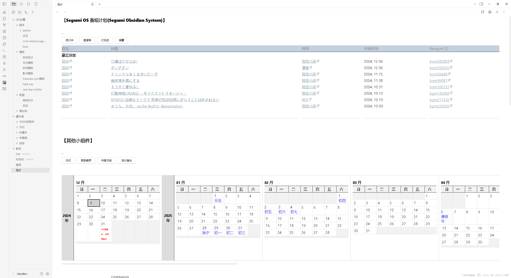
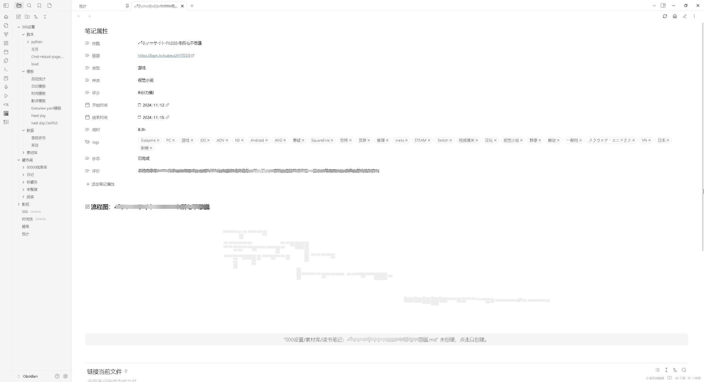

# SegumiOS(Segumi obsidian system)
一个基于Obsidian的本地点格子的系统,目前仍在开发中.

# 效果预览

# 部署
1.下载[Obsidian](https://obsidian.md/)

2.下载[obsidian的仓库](https://github.com/sedoruee/SegumiOS/releases)(注意压缩包可能有隐藏文件)

3.安装这个[chorme扩展程式](https://chromewebstore.google.com/detail/local-explorer-open-file/eokekhgpaakbkfkmjjcbffibkencdfkl),并安装以下[油猴脚本](https://chromewebstore.google.com/detail/%E7%AF%A1%E6%94%B9%E7%8C%B4/dhdgffkkebhmkfjojejmpbldmpobfkfo?hl=zh-CN):
<strong>记得把脚本内的路径改为你的本地路径!!!</strong>

[SegumiOS Open Local Explorer from Bangumi](https://greasyfork.org/zh-TW/scripts/513641-segumios-open-local-explorer-from-bangumi)

[SegumiOS Open Local Explorer from bilibili](https://greasyfork.org/zh-TW/scripts/520221-segumios-open-local-explorer-from-bilibili)

[Bangumi 复制到剪切板](https://greasyfork.org/zh-TW/scripts/519761-bangumi-%E5%A4%8D%E5%88%B6%E5%88%B0%E5%89%AA%E5%88%87%E6%9D%BF)

[打开Obsidian笔记(from bangumi)](https://greasyfork.org/zh-TW/scripts/520223-%E6%89%93%E5%BC%80obsidian%E7%AC%94%E8%AE%B0-from-bangumi)

开发中(不可用):
[Save URL to API(bilibili) ](https://greasyfork.org/zh-TW/scripts/520222-save-url-to-api-bilibili)

4.为 Obsidian仓库根目录\.code\python\移动游戏.py 创建快捷方式,并且将快捷方式放到开机启动文件夹(win+R,输入shell:startup)

5.(可选)在各个设备安装[Resilio Sync](https://www.resilio.com/sync/),并同步你的仓库文件

# 未来更新
## 短期目标
- "搁置"的作品
- 适配更多网站
- 条目的封面
- 同一系列的作品管理
- 内置的搜索和排序功能
- 更好的侧边栏
## 中期目标
- 人际关系备忘录(虚拟+现实)
- 加入三种评分，然后计算出综合得分
- 记录游戏运行时间/动画播放时间
- 给每个条目增加一个唯一的非第三方id(可能是primary key自己生成)
## 长期目标
- restful api替代剪贴板
- 脱离obsidian进行渲染和编辑

# 其他
开发QQ群:690603113
